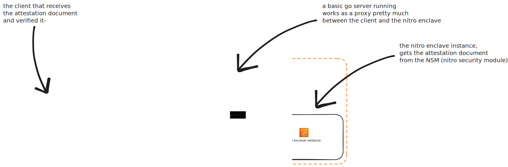

# AWS Nitro Attestation Verifier

Reference implementation of a basic AWS Nitro Enclaves remote attestation
workflow in Go.

This project shows how to:

- accept a request from an external client
- relay that request through a parent EC2 instance
- ask a real Nitro Enclave for a fresh attestation document through vsock
- return that document to the client
- verify the AWS certificate chain, COSE signature, nonce, and PCR values on
  the client side



## What This Implements

The repository is split into three runtime pieces:

1. `client/cmd/request`
   Verifies a Nitro attestation document returned by the remote host.
2. `ec2/cmd/server`
   Runs on the parent EC2 instance and relays attestation requests to the
   enclave over vsock.
3. `nitro-enclave/cmd/attestation`
   Runs inside the Nitro Enclave, calls the Nitro Security Module (`/dev/nsm`),
   and returns a fresh attestation document bound to the client nonce.

The deployed request path is:

```text
client -> EC2 HTTP relay -> vsock -> Nitro Enclave -> NSM attestation document
```

## Tech Used

- Go for the client, EC2 relay, and enclave application
- AWS Nitro Enclaves for enclave isolation and attestation
- VSock for parent-instance to enclave communication
- NSM for enclave attestation document generation
- CBOR and COSE_Sign1 for the attestation document format and signature
- Terraform for the EC2 host and supporting AWS infrastructure
- Devbox for reproducible local tooling

## Repository Status

What is already built here:

- real Nitro Enclave attestation generation inside the enclave
- parent EC2 relay over HTTP and vsock
- client-side attestation verification
- Terraform for a low-cost Nitro-capable EC2 host
- SSH-based deployment helpers that can either clone pushed `main` on the EC2
  host or rsync the current local working tree there before building and
  starting the relay plus enclave

What this repository is not trying to be:

- a production-ready confidential computing platform
- a full secret provisioning system after attestation
- a complete abstraction over Nitro Enclaves internals

It is a focused reference implementation for understanding and testing the
attestation flow end to end.

## Quick Start

Set up the local toolchain:

```sh
devbox shell
devbox run check
devbox run test
```

Deploy the parent EC2 host with SSH enabled:

```sh
MY_IP=$(curl -fsSL https://checkip.amazonaws.com | tr -d '\n')
devbox run infra:deploy -- \
  -var='use_spot=false' \
  -var='instance_type=c6g.large' \
  -var='ssh_key_name=your-ec2-key-pair-name' \
  -var="allowed_ssh_cidr_blocks=[\"${MY_IP}/32\"]"
```

Deploy the pushed `main` branch onto the parent EC2 host:

```sh
EC2_SSH_KEY_PATH=~/.ssh/your-key.pem devbox run ec2:app-deploy
```

For local uncommitted work, sync the current working tree instead:

```sh
EC2_SSH_KEY_PATH=~/.ssh/your-key.pem devbox run ec2:app-sync-deploy
```

Run the client verifier:

```sh
make nitro-root-cert
cd client
EC2_ATTESTATION_URL=$(cd .. && devbox run urls | head -n1) \
AWS_NITRO_ROOT_CERT=../.cache/aws-nitro-root/AWS_NitroEnclaves_Root-G1.pem \
go run ./cmd/request
```

Destroy the infrastructure when finished:

```sh
devbox run infra:destroy
```

## References

- [AWS Nitro Enclaves documentation](https://docs.aws.amazon.com/enclaves/latest/user/nitro-enclave.html)
- [AWS sample attestation repository](https://github.com/aws-samples/sample-nitro-enclaves-attestation)
- [Linux VM sockets in Go](https://mdlayher.com/blog/linux-vm-sockets-in-go/)
- [vsock(7)](https://man7.org/linux/man-pages/man7/vsock.7.html)

A longer write-up is intended to sit alongside this repository for the deeper
background on Nitro Enclaves, attestation, vsock, CBOR, and COSE.
